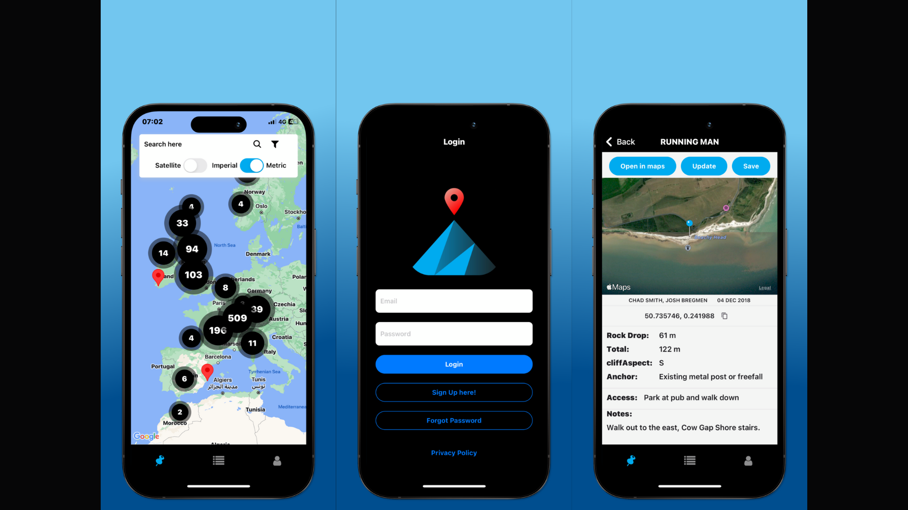
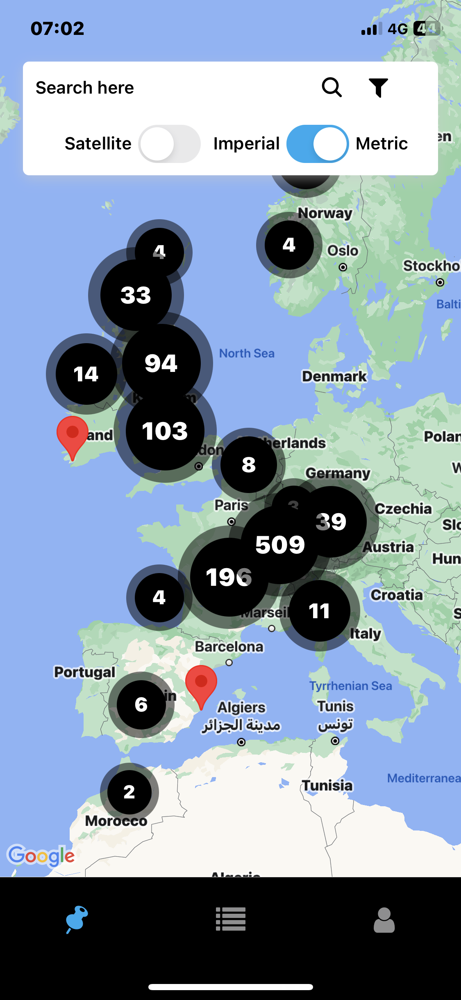
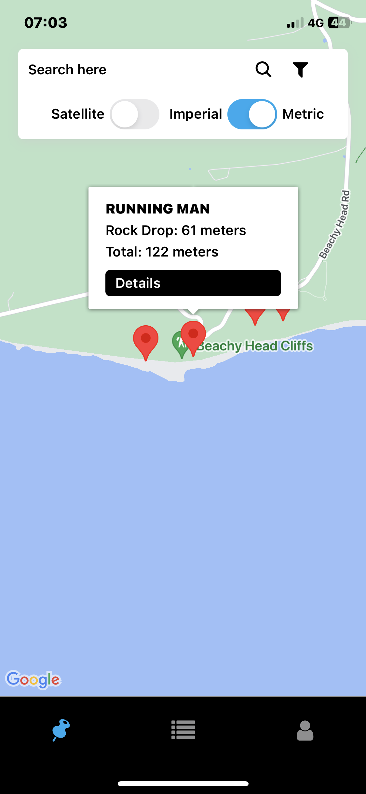
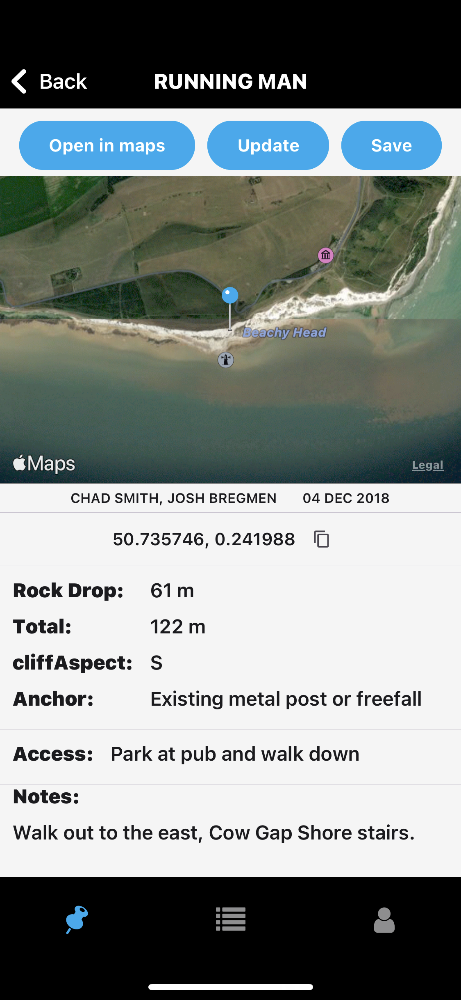
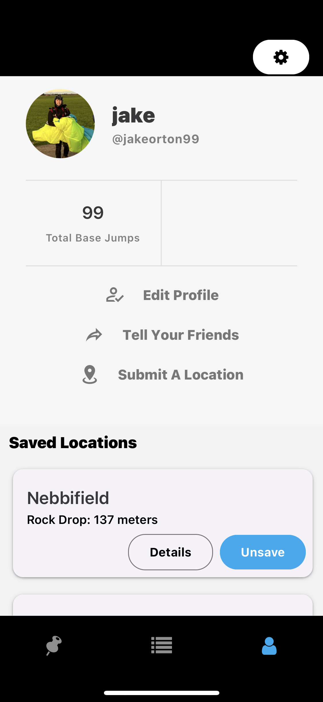
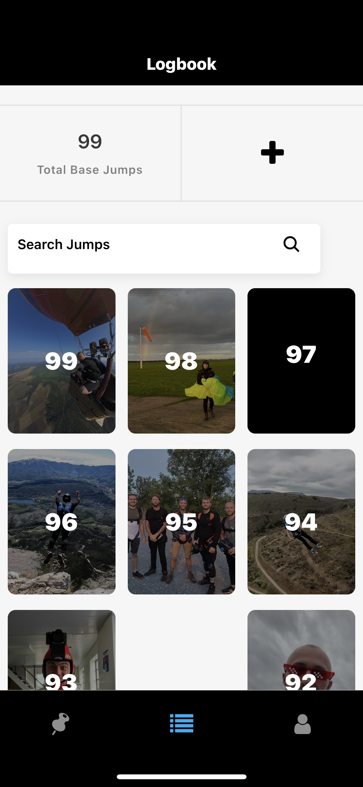
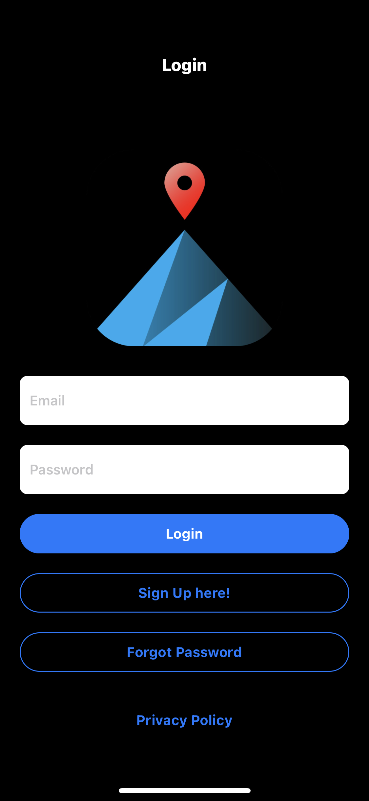

# BASE map mobile app

[Apple app store](https://apps.apple.com/us/app/base-map/id6470670905)

[Google play store](https://play.google.com/store/apps/details?id=com.jxkeorton.basemobileapp&hl=en-VN)

## TABLE OF CONTENT

- [Project Overview](#project-overview)
- [User Experience (UX)](#user-experience-ux)
  - [Goals of the app owner](#goals-of-the-app-owner)
- [Design](#design)
  - [Colours Used](#colours-used)
  - [Typography](#typography)
- [Actual Features](#actual-features)
- [Technologies Used](#technologies-used)
  - [Languages, Frameworks, Libraries \& Programs Used](#languages-frameworks-libraries--programs-used)
- [Testing and Accesibility](#testing-and-accesibility)
  - [Manual testing](#manual-testing)
- [Deployment](#deployment)
  - [Forking a Repository](#forking-a-repository)
  - [Cloning a Repository](#cloning-a-repository)
- [Contact](#contact)

## Project Overview

The "BASE map" app is a comprehensive tool tailored for individuals interested in base jumping adventures worldwide. Offering a detailed map of base jumping locations, users can access pertinent information for each site, maintain a digital logbook of their jumps, and plan future expeditions. Additionally, the app provides subscription options for access to advanced features.

## User Experience (UX)

The "BASE map" app delivers a seamless and efficient user experience for base jumping enthusiasts:

- **Discovery and Navigation:** Users can effortlessly explore a global map of base jumping sites, accessing detailed information to facilitate informed decision-making.
  
- **Planning and Documentation:** The app facilitates the organization of future jumps by enabling users to save locations and document their experiences through photos and notes within a personalized logbook.
  
- **Subscription Management:** Subscribers can easily manage their accounts and preferences through intuitive settings, ensuring uninterrupted access to the app's enhanced features and resources.

Users can explore the site from the Home page where they are greeted with a banner of a popular product. After scrolling down all the unfiltered products are revealed in a easy to view grid like fashion. 

## Goals of the app owner

- Allow users to easily navigate Base jumping locations
- There will be an optional subscription but the free version is also valuable
- The users will have an account to manage their logged jumps and favourite locations
- Submitting new information such as a location or updates
- Allow users to log their own jumps
- Deliver a seamless user friendly app that provides necessary information to the user.
  
## Design

### Colours used

- **Background colours:**
  - `white`, `#f6f6f6`, `#f4f4f4` (profile, logbook tabs)
  - `black` (auth screens)

- **Button colours:**
  - **Primary:** `#00ABF0`

### Typography

- **Font weights:**
  - Bold
  - Regular
  - 500 (semi-bold)

- **Font styles:**
  - Sans-serif

## Actual Features

- **Map:** An interactive map for users to navigate across the different locations. The pins are clustered to improve rendering speeds, I also feel that this is a more user friendly method of displaying the pins. The Search input allows you to search via the jump name or country. The two toggles allow the user to toggle satellite view and to choose the metric or imperial system for measurements across the whole app.

  

- **Infobox:** The infobox is displayed when the user clicks a location allowing them to preview the name of the jump and decide if they would like to proceed to the details page.

  

- **Details:** The details page is designed to be easy to read and understand more about the specific location. Including hazards, measurements and a map in satellite view. You can also choose to save the location , submit new details or even open in the default maps app on the users phone.

  

- **Profile:** The profile page is where users get to feel a personal touch. Here they will see all their saved locations, they can submit a new location or see the ammount of logged jumps they have which is a very important statistic to indicate experience levels.

  

- **Logbook:** The logbook feature allows users to upload new jumps and also add relevent details including up to 4 photos. This decission was made due to the ammount of storage too many photos could take in the backend. Upon reevaluating since the apps use it turns out users would prefer a more basic view which prioritises increased load times and speed of adding new jumps. This will be updated in the future.

  

- **Login:** The login screen is the first screen a user will see if they have never used the app before, here they can navigate to the register screen or forgotten password screen.

  

## Technologies Used

### Languages, Frameworks, Libraries & Programs Used

- **Languages:**
  - [JavaScript](https://developer.mozilla.org/en-US/docs/Web/JavaScript): A versatile scripting language widely used for web development.

- **Frameworks & Libraries:**
  - [React Native](https://reactnative.dev/): A JavaScript framework for building native mobile applications.
  - [RevenueCat](https://www.revenuecat.com/): A platform for managing in-app purchases and subscriptions in mobile apps.
  - [Expo](https://expo.dev/): A platform and set of tools for building and deploying React Native applications.
  - [Firebase](https://firebase.google.com/): A comprehensive platform provided by Google for mobile and web application development, offering features like authentication, database, and storage.
  - [Expo Router](https://github.com/lukebrandonfarrell/expo-router): A routing library specifically designed for use with Expo projects.
  - [Expo Image](https://docs.expo.dev/versions/latest/sdk/image/), [Expo Image Manipulator](https://docs.expo.dev/versions/latest/sdk/image-manipulator/), [Expo Image Picker](https://docs.expo.dev/versions/latest/sdk/imagepicker/): Expo modules for handling images in applications.
  - [Expo Linking](https://docs.expo.dev/versions/latest/sdk/linking/): A module for handling deep linking and opening external URLs in Expo apps.
  - [React](https://reactjs.org/): A JavaScript library for building user interfaces.
  - [React Native Maps](https://github.com/react-native-maps/react-native-maps): A React Native library for integrating maps into mobile applications.
  - [React Native Paper](https://callstack.github.io/react-native-paper/): A Material Design component library for React Native.
  - [React Native Purchases](https://github.com/react-native-purchases/react-native-purchases): A React Native library for handling in-app purchases.
  - [React Native Safe Area Context](https://docs.expo.dev/versions/latest/sdk/safe-area-context/): A module for managing safe areas in Expo applications.
  - [React Native Screens](https://github.com/software-mansion/react-native-screens): A library for improved navigation performance in React Native apps.
  - [React Native Toast Message](https://github.com/calintamas/react-native-toast-message): A React Native component for displaying toast messages.
  - [React Native Vector Icons](https://github.com/oblador/react-native-vector-icons): A library providing customizable icons for React Native applications.
  - [React Native Web](https://github.com/necolas/react-native-web): A library for running React Native components and APIs on the web.
  - [React Native Linear Gradient](https://github.com/react-native-linear-gradient/react-native-linear-gradient): A React Native component for creating linear gradients.
  - [React Native Map Clustering](https://github.com/novalabio/react-native-map-clustering): A library for clustering markers on maps in React Native applications.
  - [Pullstate](https://github.com/lostpebble/pullstate): A simple state store for managing application state in React applications.
  - [UUID](https://github.com/uuidjs/uuid): A library for generating universally unique identifiers.

- **Tools & Programs:**
  - [Expo CLI](https://docs.expo.dev/workflow/expo-cli/): Command-line interface for managing Expo projects.
  - [npm](https://www.npmjs.com/): Package manager for JavaScript, used for installing and managing project dependencies.
  - [Uglify JS](https://github.com/mishoo/UglifyJS): A JavaScript minifier/compressor used to reduce file sizes in production.
  - [GitHub](https://github.com/): A web-based hosting service for version control using Git, utilized as a repository for storing the project.

## Testing and Accesibility
  
The app was tested using emulators specific to apple and android devices. Also there was a test audience before the app was released.
The test audience found numerous errors such as app crashing when trying to upload images or submitting updates. These were due to errors in the functions i created to send data to the firebase database. These were resolved.

### Manual testing

- Every button , Screen , Form and Input was tested manually.

- Through manual tests I realised logbook load times were too slow when including images, to solve this I compressed all images before they were sent to the backend.
- I also found that utilising Async storage was necesarry when accessing the details page, this prevented an unecessary fetch request which took a long time.

### Deployment

#### Deployment to Apple App Store (iOS)

1. **Prepare Your App:**
   - Ensure completion of development and testing.
   - Create required app assets like icons and screenshots.

2. **Generate Certificate and Profile:**
   - Create an iOS Distribution Certificate and Provisioning Profile in Apple Developer account.

3. **Archive and Submit:**
   - Archive your app in Xcode, ensuring proper build configuration.
   - Submit your app to App Store Connect with necessary details.

4. **App Review Process:**
   - Apple will review your app for compliance with guidelines.
   - Upon approval, your app will be available on the App Store.

#### Deployment to Google Play Store (Android)

1. **Prepare Your App:**
   - Thoroughly test your app and prepare necessary assets.

2. **Create Keystore:**
   - Generate a keystore file for signing your Android app.

3. **Build APK/Bundle:**
   - Use `expo build:android` to generate APK or App Bundle.

4. **Upload to Play Console:**
   - Log in to Google Play Console and upload your APK or Bundle.

5. **Review and Publish:**
   - Review app details and submit for Google's review.
   - Once approved, your app will be published on the Play Store.

#### Forking a Repository

1.Log in to GitHub and locate the repository that you want to fork.

2.Click on the 'Fork' button found on the top right of the repository page.

3.Select the destination where you want to fork the repository.

4.After forking is complete, you'll be redirected to your forked repository.

#### Cloning a Repository

1.On the GitHub repository page, click on the "Code" button and copy the repository URL provided.

2.Open your terminal and navigate to the directory where you want to clone the repository.

3.Use the 'git clone' command followed by the repository URL you copied and press 'Enter'

### Code

- Youtube tutorials were used.These tutorials were instrumental in helping me understand how to effectively use Sanity in the development.

## Contact
For any inquiries or feedback regarding the UK BASE Jumping Map application, please contact the project maintainer at jakelewisorton@gmail.com
